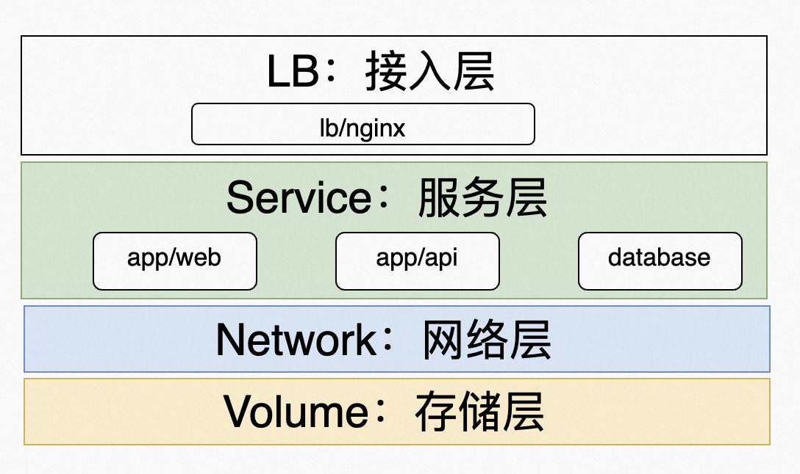
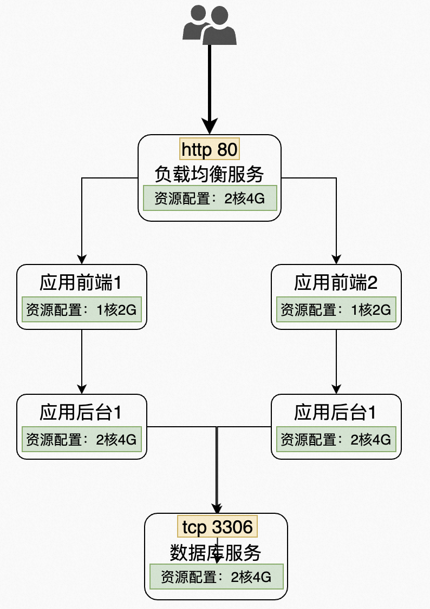

# Shenzhou
基于 docker 和 docker-compose 工具改造原应用，采用基于容器的新部署架构。



### 实现思路说明
* 按功能将原系统分为以下4个模块：
  + 负载均衡：lb 子目录下；
  + 应用前端：app/web 子目录下；
  + 应用后端：app/api 子目录下；
  + mysql数据库：database 子目录下；
* 打包各模块为 docker 镜像，具体实现见各子目录下 Dockerfile 文件；
* 利用 docker-compose 申明各模块的运行时资源及环境变量配置，详细见 docker-compose.yml 文件；
* 利用 docker-compose service links 功能，描述各服务的依赖关系，并将服务名称/DNS Name 注入运行环境；
* 利用 docker-compose scale 功能，将应用前后台服务扩展到两个运行实例，为实现负载均衡和高可用架构做好准备；
* 利用 nginx 作为负载均衡服务，提供对流量入口的统一管理，负载均衡的流量分发功能依托 docker 内置的DNS系统实现；

#### 测试运行命令说明
0. 假设目标运行环境为Ubunt，并已具备 docker 和 docker-compose 命令；
1. 准备 docker 镜像：
```
  docker-compose pull mysql8
  docker-compose build --force-rm lb
  docker-compose build --force-rm --build-arg JAVA_TAG=8u102 api
  docker-compose build --force-rm --build-arg NGINX_TAG=1.23.3-alpine app
```
2. 启动服务并查看服务状态和日志：
```
  # 启动所有服务，并扩展应用前端/后台运行两个实例
  docker-compose up -d --scale api=2 --scale app=2 lb
  
  # 检查服务启动状态及日志
  docker-compose ps
  docker-compose logs
```

#### 按模块代码说明
##### 应用前台
前台 web 应用的部署配置及脚本在 app/web 目录下，为方便演示模拟了前台 web 应用：web/dist.tar.gz，并假设运行环境为 nginx 1.23.3。
[注意：为了使用 Dockerfile 的 ADD 命令自动解压dist文件，将原.zip后缀修改成：.tar.gz]

#### 应用后台
后台 api 服务的部署配置及脚本在 app/api 目录下，为方便演示模拟了后台 api 服务：productksys.jar，并假设运行环境为 openjdk 1.8。
[注意：为了最大化兼容Gradle build script打包输出的实际文件名称，调整了原jar文件名称为：productksys-0.0.1.jar]

#### mysql 数据库服务
MySQL 数据库服务的配置及脚本在 database 目录下，采用 mysql 8.0.32 版本，并注入init脚本用于表构初始化。

#### 负载均衡服务
负载均衡服务配置及脚本在 lb 目录下，采用 nginx 1.23.3 版本，通过环境变量可配置目标应用的Host Name及权重信息，未来若有调整负载均衡算法的需求，可进一步完善：etc/nginx/templates/default.conf.template 文件。


### 参考信息
* https://snapcraft.io/docker
* https://docs.docker.com/compose/compose-file/compose-file-v3
